# Diagram Management

Diagram management is handled via the [MkDocs Kroki Plugin](https://pypi.org/project/mkdocs-kroki-plugin/), which uses the Kroki server hosted at [https://kroki.tiogars.fr](https://kroki.tiogars.fr).

## Mermaid

```mermaid
graph TD
    A[Début] --> B[Processus]
    B --> C[Fin]
```



## Gantt with Mermaid

```kroki-mermaid
gantt
    title A Gantt Diagram
    dateFormat  YYYY-MM-DD
    section Section
    A task           :a1, 2014-01-01, 30d
    Another task     :after a1, 20d
    section Another
    Task in sec      :2014-01-12, 12d
    another task     :24d
```

## Network Diagrams with nwdiag

```kroki-nwdiag
nwdiag {
  network dmz {
    address = "210.x.x.x/24"

    web01 [address = "210.x.x.1"];
    web02 [address = "210.x.x.2"];
  }
  network internal {
    address = "172.x.x.x/24";

    web01 [address = "172.x.x.1"];
    web02 [address = "172.x.x.2"];
    db01;
    db02;
  }
}
```
