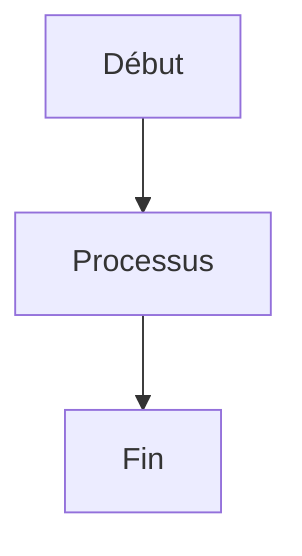

# mkdocs-docker-image

## Objectif

Ce dépôt a pour but de fournir une image Docker pour générer un site web à l'aide du framework MkDocs avec des plugins utiles préinstallés, facilitant ainsi la création et la gestion de documentation technique.

## Fonctionnalités

- environnement python [3.14.0-slim](https://hub.docker.com/_/python/)
- génération de documentation statique avec [MkDocs](https://www.mkdocs.org/)
- thème "Material for MkDocs"
  - [Site web](https://squidfunk.github.io/mkdocs-material/)
  - [Github](https://github.com/squidfunk/mkdocs-material)
- support multilingue avec "mkdocs-static-i18n"
  - [Site web](https://ultrabug.github.io/mkdocs-static-i18n/)
  - [Github](https://github.com/ultrabug/mkdocs-static-i18n)
- export PDF du site complet avec "mkdocs-to-pdf" :
  - [Site web](https://mkdocs-to-pdf.readthedocs.io/en/latest/)
  - [Github](https://github.com/domWalters/mkdocs-to-pdf)
  - [Pypi](https://pypi.org/project/mkdocs-to-pdf/)
- recherche avec "search"
- diagrammes avec "mkdocs-kroki-plugin"
  - [Site web](https://kroki.io/)
  - [Github](https://github.com/fralau/mkdocs-kroki-plugin)

## Liens

- [Catalogue des plugins MkDocs](https://github.com/mkdocs/catalog)

## Problèmes connus

- Le pdf généré pour chaque langue écrase le pdf prcédent.
- Le plugin "mkdocs-static-i18n" n'est pas encore totalement compatible avec "mkdocs-to-pdf". [Voir l'issue #329](https://github.com/ultrabug/mkdocs-static-i18n/issues/329) pour plus de détails.

## Dépendances

- MkDocs
  - python
  - pip

## Gestion des digrammes

La gestion des diagrammes est assurée via le plugin [MkDocs Kroki Plugin](https://pypi.org/project/mkdocs-kroki-plugin/), qui utilise le serveur Kroki hébergé à l'adresse [https://kroki.tiogars.fr](https://kroki.tiogars.fr).

### Mermaid



### Gantt with Mermaid

```kroki-mermaid
gantt
    title A Gantt Diagram
    dateFormat  YYYY-MM-DD
    section Section
    A task           :a1, 2014-01-01, 30d
    Another task     :after a1, 20d
    section Another
    Task in sec      :2014-01-12, 12d
    another task     :24d
```

### Diagrammes réseau avec nwdiag

```kroki-nwdiag
nwdiag {
  network dmz {
    address = "210.x.x.x/24"

    web01 [address = "210.x.x.1"];
    web02 [address = "210.x.x.2"];
  }
  network internal {
    address = "172.x.x.x/24";

    web01 [address = "172.x.x.1"];
    web02 [address = "172.x.x.2"];
    db01;
    db02;
  }
}
```
